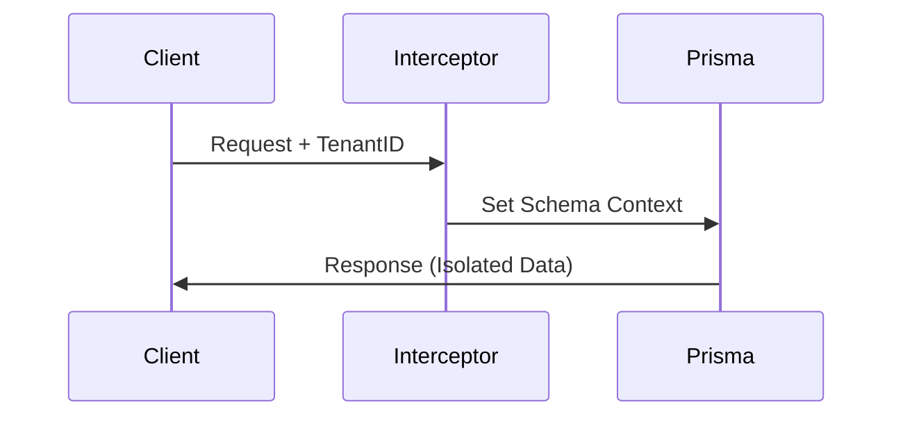

graph LR
    A[Client Request] --> B{Tenant Interceptor}
    B -->|X-Tenant-ID| C[Prisma Manager]
    C --> D[(PostgreSQL: Schema A)]
    C --> E[(PostgreSQL: Schema B)]

    # System Architecture - Booking SaaS

## 1. Overview
This document describes the high-level design and technical decisions for the Booking platform.

## 2. Infrastructure Stack
| Layer          | Technology       | Purpose                        |
|----------------|------------------|--------------------------------|
| **Framework** | NestJS           | Modular backend architecture   |
| **ORM** | Prisma           | Type-safe DB access            |
| **Database** | PostgreSQL       | Relational data with Schemas   |
| **Cache** | Redis            | Tenant config & Session cache  |

## 3. High-Level Flow
The system uses a **Dynamic Tenant Provider**. Every request is intercepted to switch the database context based on the header.


---


```
┌─────────────────────────────────────────────────────────────┐
│                    Payment Journey                          │
└─────────────────────────────────────────────────────────────┘

1. Frontend
   ↓
   User clicks "Pay"
   ↓
2. Your Backend
   POST /payments/initiate
   ↓
3. Your Backend → Stripe
   Create PaymentIntent
   ↓
4. Return to Frontend
   clientSecret + publishableKey
   ↓
5. Frontend → Stripe
   Collect card details
   ↓
6. Stripe confirms payment
   ↓
7. *** Stripe sends WEBHOOK ***
   POST /webhooks/stripe
   ↓
8. Your Backend (Webhook Handler)
   Verify signature
   Emit event: "PaymentCompleted"
   ↓
9. Event-Driven Handlers
   ├─ BookingsService.markAsPaid()
   ├─ NotificationsService.sendReceipt()
   ├─ AnalyticsService.recordRevenue()
   └─ LedgerService.createEntry()
```
---
