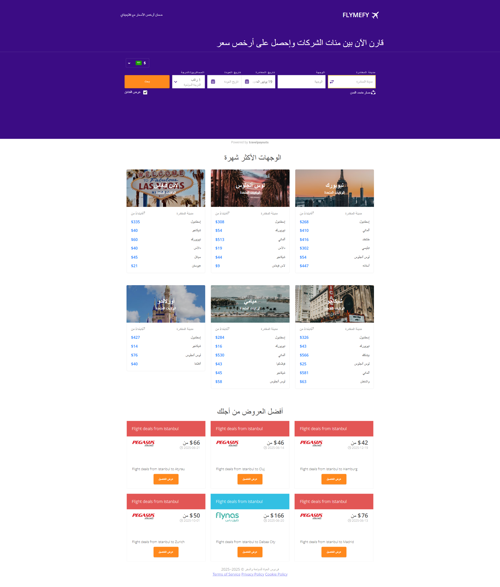

# 🚀 Flymefy Theme - Your Ultimate Travel Companion

A modern, responsive travel booking website built with Next.js 15 and React 18. Book flights, hotels, cars, tours, cruises, activities and rentals all in one place.



## ✨ Features

### 🌟 Travel Services
- **✈️ Flights** - Search and book flights worldwide
- **🏨 Hotels** - Find and reserve accommodations  
- **🚗 Cars** - Rent vehicles for your trips
- **🗺️ Tours** - Discover guided tours and experiences
- **🚢 Cruises** - Book luxury cruise packages
- **🎯 Activities** - Find exciting local activities
- **🏡 Rentals** - Book vacation rentals and properties

### 🎯 Core Features
- **Responsive Design** - Works perfectly on all devices
- **Modern UI/UX** - Clean, intuitive interface
- **Fast Performance** - Optimized for speed
- **SEO Optimized** - Built-in SEO best practices
- **Multi-language Support** - English and Arabic ready
- **User Dashboard** - Manage bookings and preferences
- **Clean Codebase** - Optimized and organized structure

## 🛠️ Tech Stack

- **Frontend**: Next.js 15, React 18
- **Styling**: SCSS, Bootstrap 5.3
- **State Management**: Redux Toolkit 2.0
- **Animations**: AOS (Animate On Scroll)
- **Icons**: React Icons 5.5
- **Image Optimization**: Next.js Image component
- **Deployment Ready**: Vercel, Netlify compatible

## 🚀 Quick Start

### Prerequisites
- Node.js 18+ 
- npm or yarn

### Installation

1. **Clone the repository**
   ```bash
   git clone https://github.com/yourusername/flymefy-theme.git
   cd flymefy-theme
   ```

2. **Install dependencies**
   ```bash
   npm install
   ```

3. **Start development server**
   ```bash
   npm run dev
   ```

4. **Open your browser**
   ```
   http://localhost:3000
   ```

## 📁 Project Structure (Clean & Optimized)

```
flymefy-theme/
├── app/                      # Next.js App Router pages
│   ├── (homes)/             
│   │   └── home_1/          # Main homepage
│   ├── (flight)/            
│   │   ├── flight-list-v1/  # Flight search & booking
│   │   └── pkfare-search/   # Advanced flight search
│   ├── (hotel)/             
│   │   ├── hotel-list-v1/   # Hotel search & booking
│   │   ├── hotel-single-v1/ # Hotel details
│   │   └── booking-page/    # Hotel booking
│   ├── (car)/               
│   │   ├── car-list-v1/     # Car rental search
│   │   └── car-single/      # Car details
│   ├── (tour)/              
│   │   ├── tour-list-v1/    # Tour packages
│   │   └── tour-single/     # Tour details
│   ├── (cruise)/            
│   │   ├── cruise-list-v1/  # Cruise packages
│   │   └── cruise-single/   # Cruise details
│   ├── (activity)/          
│   │   ├── activity-list-v1/ # Activities search
│   │   └── activity-single/ # Activity details
│   ├── (rental)/            
│   │   ├── rental-list-v1/  # Vacation rentals
│   │   └── rental-single/   # Rental details
│   ├── (blogs)/             
│   │   ├── blog-list-v1/    # Blog listing
│   │   └── blog-details/    # Blog post details
│   ├── (dashboard)/         
│   │   └── dashboard/       # User dashboard
│   │       ├── db-dashboard/ # Main dashboard
│   │       ├── db-booking/   # Booking management
│   │       ├── db-wishlist/  # User wishlist
│   │       └── db-settings/  # Account settings
│   ├── (others)/            
│   │   ├── about/           # About us page
│   │   ├── contact/         # Contact page
│   │   ├── destinations/    # Destinations page
│   │   ├── help-center/     # Help & support
│   │   ├── login/           # User login
│   │   ├── signup/          # User registration
│   │   └── terms/           # Terms & conditions
│   ├── api/                 # API routes
│   └── booking/             # Booking confirmation pages
├── components/              # Reusable UI components
│   ├── layout/              # Layout components (Header, Footer)
│   ├── common/              # Shared components
│   ├── header/              # Header variations
│   ├── footer/              # Footer variations
│   └── [service-specific]/  # Service-specific components
├── data/                    # Static data and configurations
├── public/                  # Static assets
├── styles/                  # Global styles and SCSS files
└── utils/                   # Utility functions
```

## 📱 Available Pages

### **Main Services**
- **🏠 Home** (`/`) - Landing page with search
- **✈️ Flights** (`/flight-list-v1`) - Flight search & booking  
- **🏨 Hotels** (`/hotel-list-v1`) - Hotel search & reservation
- **🚗 Cars** (`/car-list-v1`) - Car rental booking
- **🗺️ Tours** (`/tour-list-v1`) - Tour packages
- **🚢 Cruises** (`/cruise-list-v1`) - Cruise packages
- **🎯 Activities** (`/activity-list-v1`) - Local activities
- **🏡 Rentals** (`/rental-list-v1`) - Vacation rentals

### **User Management**
- **👤 Login** (`/login`) - User authentication
- **📝 Register** (`/signup`) - Account creation
- **📊 Dashboard** (`/dashboard/db-dashboard`) - User control panel
- **📋 My Bookings** (`/dashboard/db-booking`) - Booking management
- **❤️ Wishlist** (`/dashboard/db-wishlist`) - Saved favorites
- **⚙️ Settings** (`/dashboard/db-settings`) - Account settings

### **Information Pages**
- **ℹ️ About Us** (`/about`) - Company information
- **📞 Contact** (`/contact`) - Contact form
- **🌍 Destinations** (`/destinations`) - Popular destinations
- **❓ Help Center** (`/help-center`) - Support & FAQ
- **📜 Terms** (`/terms`) - Terms & conditions
- **📝 Blog** (`/blog-list-v1`) - Travel blog

## 🎨 Customization

### Theme Colors
Edit the main colors in `/styles/index.scss`:
```scss
:root {
  --color-blue-1: #3554d1;
  --color-blue-2: #f0f5ff;
  --color-dark-1: #1a2b48;
}
```

### Navigation Menu
Update navigation menu in `/data/mainMenuData.js`:
```javascript
export const servicesItems = [
  {
    name: "Flights",
    routePath: "/flight-list-v1",
    icon: "icon-airplane",
  },
  // Add more services...
];
```

## 🧹 Project Optimization

✅ **Removed unnecessary pages & files:**
- Multiple home variations (kept home_1 only)
- Duplicate service pages (kept v1 versions only)  
- Unused components and routes
- Vendor dashboard (kept user dashboard only)
- Redundant blog versions

✅ **Clean structure with:**
- Essential pages only
- Optimized file structure
- Updated dependencies
- Clean navigation
- Unified layout system

## 🔧 Configuration

### Environment Variables
Create a `.env.local` file:
```env
NEXT_PUBLIC_SITE_URL=http://localhost:3000
NEXT_PUBLIC_SITE_NAME=Flymefy
PKFARE_API_URL=your_api_url
PKFARE_PARTNER_ID=your_partner_id
PKFARE_PARTNER_KEY=your_partner_key
```

## 🚀 Deployment

### Build & Start
```bash
npm run build
npm start
```

### Vercel (Recommended)
1. Push your code to GitHub
2. Connect repository to Vercel
3. Deploy automatically

## 📊 Performance

- **Optimized bundle size** - Removed unused code
- **Fast loading** - Next.js 15 optimizations
- **SEO ready** - Meta tags and structured data
- **Mobile responsive** - Works on all devices
- **Clean code** - Well-organized and maintainable

## 🆘 Support

- **Issues**: Open an issue on GitHub
- **Documentation**: Check the code comments
- **Email**: support@flymefy.com

## 🙏 Acknowledgments

- Built on Next.js 15 & React 18
- Icons from React Icons
- Animations powered by AOS
- Bootstrap for responsive design
- Optimized from GoTrip template

---

**Made with ❤️ for travelers around the world**

*Happy travels! ✈️🌍* 