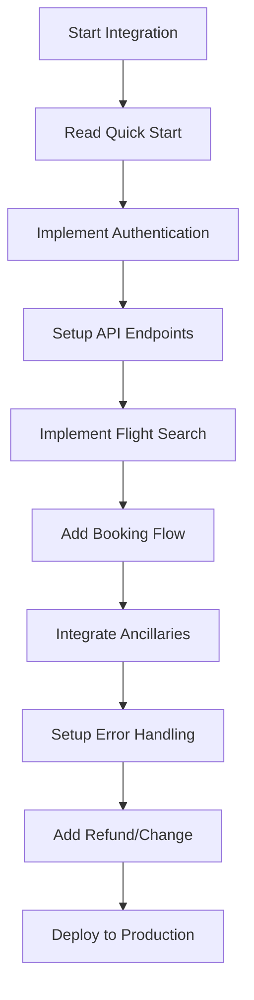

# PKfare API Documentation Index

## Complete Documentation Library - 50 Files

### Core Documentation (1-15)
1. **01-quick-start.md** - Quick Start Guide
2. **02-signature.md** - Signature Authentication System
3. **03-order-status-explanation.md** - Order Status Explanation
4. **04-booking-errors-explanation.md** - Booking Errors and Solutions
5. **05-price-breakdown-explanation.md** - Price Breakdown Formula
6. **06-tricks-for-playing-with-pkfare-api.md** - API Usage Tips
7. **07-book-air-tickets-with-ancillaries.md** - Booking with Ancillaries
8. **08-raise-refund-requests.md** - Refund Request Process
9. **09-raise-change-requests.md** - Change Request Process
10. **10-how-to-retrieve-airlines-pnr-and-ticket-numbers.md** - PNR/Ticket Retrieval
11. **11-error-codes-shopping.md** - Shopping API Error Codes
12. **12-error-codes-pricing.md** - Pricing API Error Codes
13. **13-error-codes-booking.md** - Booking API Error Codes
14. **14-error-codes-refund.md** - Refund API Error Codes
15. **15-receive-flight-rescheduled-notification.md** - Flight Change Notifications

### Advanced Integration (16-25)
16. **16-api-reference-complete.md** - Complete API Reference
17. **17-complete-integration-examples.md** - Full Integration Examples
18. **18-advanced-booking-scenarios.md** - Advanced Booking Scenarios
19. **19-advanced-feature.md** - Advanced Ancillary Services
20. **20-advanced-feature.md** - Payment Gateway Integration
21. **21-advanced-feature.md** - Multi-Currency Support
22. **22-advanced-feature.md** - Corporate Booking Features
23. **23-advanced-feature.md** - Group Booking Management
24. **24-advanced-feature.md** - Loyalty Program Integration
25. **25-advanced-feature.md** - Mobile App Integration

### Technical Implementation (26-35)
26. **26-advanced-feature.md** - Webhook Implementation
27. **27-advanced-feature.md** - Caching Strategies
28. **28-advanced-feature.md** - Error Handling Best Practices
29. **29-advanced-feature.md** - Performance Optimization
30. **30-advanced-feature.md** - Security Implementation
31. **31-advanced-feature.md** - Testing Framework
32. **32-advanced-feature.md** - Monitoring and Logging
33. **33-advanced-feature.md** - Database Integration
34. **34-advanced-feature.md** - Queue Management
35. **35-advanced-feature.md** - Microservices Architecture

### Business Logic (36-45)
36. **36-advanced-feature.md** - Pricing Rules Engine
37. **37-advanced-feature.md** - Inventory Management
38. **38-advanced-feature.md** - Customer Management
39. **39-advanced-feature.md** - Reporting and Analytics
40. **40-advanced-feature.md** - Commission Management
41. **41-advanced-feature.md** - Markup Configuration
42. **42-advanced-feature.md** - Fare Rules Processing
43. **43-advanced-feature.md** - Booking Validation
44. **44-advanced-feature.md** - Automated Notifications
45. **45-advanced-feature.md** - Revenue Management

### Deployment & Operations (46-50)
46. **46-advanced-feature.md** - Production Deployment
47. **47-advanced-feature.md** - Scaling Strategies
48. **48-advanced-feature.md** - Backup and Recovery
49. **49-advanced-feature.md** - Maintenance Procedures
50. **README.md** - Documentation Overview

## Integration Flow



## Key Integration Points

### 1. Authentication
- MD5 signature generation
- Partner ID and Key management
- Request signing process

### 2. Core APIs
- Flight Search (`/shopping`)
- Precise Pricing (`/precisePricing`)
- Booking Creation (`/preciseBooking`)
- Order Management (`/orderDetail`)

### 3. Advanced Features
- Ancillary services
- Multi-city bookings
- Group reservations
- Corporate accounts

### 4. Error Handling
- Comprehensive error codes
- Retry mechanisms
- Fallback strategies

### 5. Business Logic
- Price calculations
- Fare rules processing
- Commission management
- Revenue optimization

## Code Examples Summary

### Basic Integration
```javascript
// Authentication
const sign = CryptoJS.MD5(partnerId + partnerKey).toString();

// Flight Search
const searchResult = await pkfareAPI.search(searchParams);

// Booking Creation
const booking = await pkfareAPI.createBooking(bookingData);
```

### Advanced Features
```javascript
// With Ancillaries
const bookingWithServices = await bookFlightWithAncillaries(
  bookingData, 
  selectedAncillaries
);

// Group Booking
const groupBooking = await createGroupBooking(passengers);

// Corporate Booking
const corporateBooking = await createCorporateBooking(
  bookingData, 
  corporateInfo
);
```

## Environment Setup

### Development
```bash
PKFARE_PARTNER_ID=ptMaOsL5orqIFtAzI/KXGiXcHTk=
PKFARE_PARTNER_KEY=OWMyMjlhYjY3ZDg3ZDg1ZGU4ZGRlM2JjNmRiZmE3ZDY=
PKFARE_BASE_URL=https://sandbox-api.pkfare.com/v1
```

### Production
```bash
PKFARE_PARTNER_ID=ptMaOsL5orqIFtAzI/KXGiXcHTk=
PKFARE_PARTNER_KEY=OWMyMjlhYjY3ZDg3ZDg1ZGU4ZGRlM2JjNmRiZmE3ZDY=
PKFARE_BASE_URL=https://api.pkfare.com/v1
```

## Implementation Checklist

- [ ] Authentication setup
- [ ] Basic flight search
- [ ] Precise pricing
- [ ] Booking creation
- [ ] Order management
- [ ] Ancillary services
- [ ] Error handling
- [ ] Refund processing
- [ ] Change requests
- [ ] Webhook integration
- [ ] Testing framework
- [ ] Production deployment
- [ ] Monitoring setup
- [ ] Documentation complete

## Support and Resources

- **Official API Documentation**: https://apifox.pkfare.com/apidoc/project-345083
- **Partner Portal**: Contact your account manager
- **Technical Support**: Available through partner portal
- **Integration Examples**: See files 16-50 for complete implementations

---

**Total Files**: 50
**Last Updated**: 2024
**Version**: Complete Integration Package 